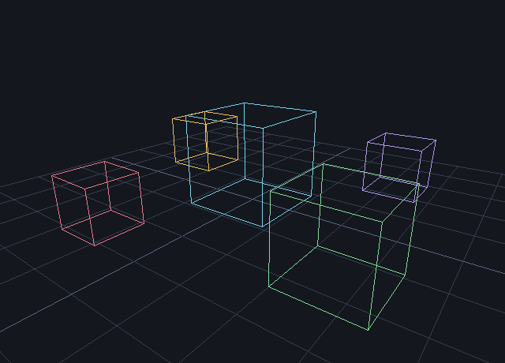

# sml-camera

Pure-Standard-ML **scene math** built on
[`sml-glm`](https://github.com/sjqtentacles/sml-glm): transforms, cameras,
frustum culling, and ray/volume intersection primitives. No FFI, no C — just
the Basis Library plus the vendored `sml-glm`. Deterministic and byte-identical
across [MLton](http://mlton.org/) and [Poly/ML](https://www.polyml.org/).



*Generated by [`examples/scene_demo.sml`](examples/scene_demo.sml) (`make
example`): a ground grid and five wireframe cubes placed in world space and
projected through `Scene.viewProjection` (a perspective camera), drawn with the
vendored `sml-raster`.*

- **Transforms** — a `{ position, rotation (quat), scale }` record with
  `toMat4` (T·R·S), parent/child `compose`, and point `apply`.
- **Camera** — `view` (lookAt), `projection` (perspective), and
  `viewProjection`, from a single camera record.
- **Frustum culling** — extract the 6 inward-facing planes from a
  view-projection matrix and test points, spheres, and AABBs (conservative:
  straddling volumes are kept).
- **Intersections** — `rayAabb`, `raySphere`, `rayTriangle` (Möller–Trumbore),
  and `aabbAabb`. Ray queries return `SOME t` (parameter of first hit) or `NONE`.

Right-handed coordinates, GL clip space (z ∈ [−1, 1]), angles in radians.

## Installation

With [`smlpkg`](https://github.com/diku-dk/smlpkg):

```sh
smlpkg add github.com/sjqtentacles/sml-camera
smlpkg sync
```

Then build from `src/scene.mlb` (which pulls in the vendored `sml-glm`).

## API

```sml
structure Glm : GLM

type transform = { position : Glm.Vec3.t, rotation : Glm.Quat.t, scale : Glm.Vec3.t }
val identity : transform
val translation : Glm.Vec3.t -> transform
val fromTRS : Glm.Vec3.t * Glm.Quat.t * Glm.Vec3.t -> transform
val toMat4  : transform -> Glm.Mat4.t
val compose : transform * transform -> Glm.Mat4.t
val apply   : transform * Glm.Vec3.t -> Glm.Vec3.t

type camera = { eye : Glm.Vec3.t, center : Glm.Vec3.t, up : Glm.Vec3.t,
                fovy : real, aspect : real, near : real, far : real }
val view : camera -> Glm.Mat4.t
val projection : camera -> Glm.Mat4.t
val viewProjection : camera -> Glm.Mat4.t

type aabb   = { min : Glm.Vec3.t, max : Glm.Vec3.t }
type sphere = { center : Glm.Vec3.t, radius : real }
type ray    = { origin : Glm.Vec3.t, dir : Glm.Vec3.t }
type plane   = { normal : Glm.Vec3.t, d : real }
type frustum = plane list

val frustumOf : Glm.Mat4.t -> frustum
val containsPoint    : frustum * Glm.Vec3.t -> bool
val intersectsSphere : frustum * sphere -> bool
val intersectsAabb   : frustum * aabb -> bool

val rayAabb     : ray * aabb -> real option
val raySphere   : ray * sphere -> real option
val rayTriangle : ray * (Glm.Vec3.t * Glm.Vec3.t * Glm.Vec3.t) -> real option
val aabbAabb    : aabb * aabb -> bool
```

## Example

```sml
val cam = { eye = Glm.Vec3.v (0.0,0.0,0.0), center = Glm.Vec3.v (0.0,0.0,~1.0),
            up = Glm.Vec3.v (0.0,1.0,0.0), fovy = Glm.radians 60.0,
            aspect = 16.0/9.0, near = 0.1, far = 100.0 }
val fr  = Scene.frustumOf (Scene.viewProjection cam)
val vis = Scene.intersectsSphere (fr, { center = Glm.Vec3.v (0.0,0.0,~5.0), radius = 1.0 })
```

## Building & testing

```sh
make test        # build + run under MLton
make test-poly   # run under Poly/ML
make all-tests   # both compilers
```

The suite covers transform composition vs. matrix products, view/projection
agreement with the `sml-glm` builders, frustum culling (inside kept / clearly
outside culled / straddling kept), and intersection hits & misses — including
the tricky edge cases: ray parallel to an AABB slab (no division blow-up),
grazing/tangent sphere rays, origin-inside volumes, and degenerate
(zero-area) triangles.

## License

See [LICENSE](LICENSE).
